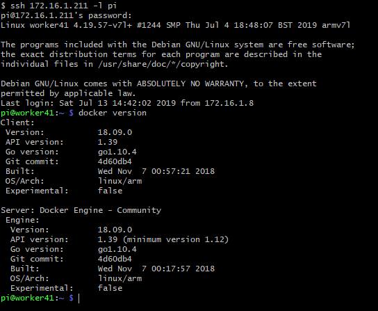
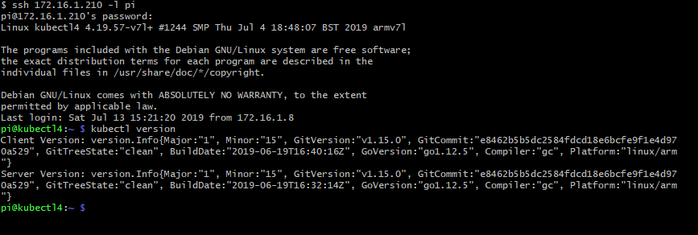
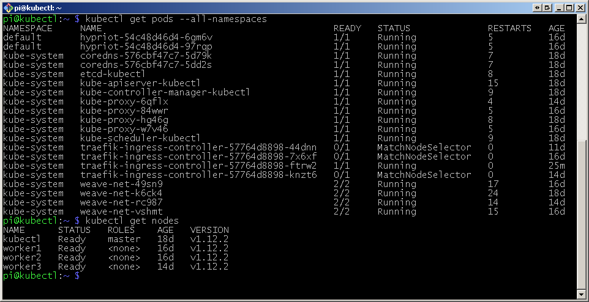
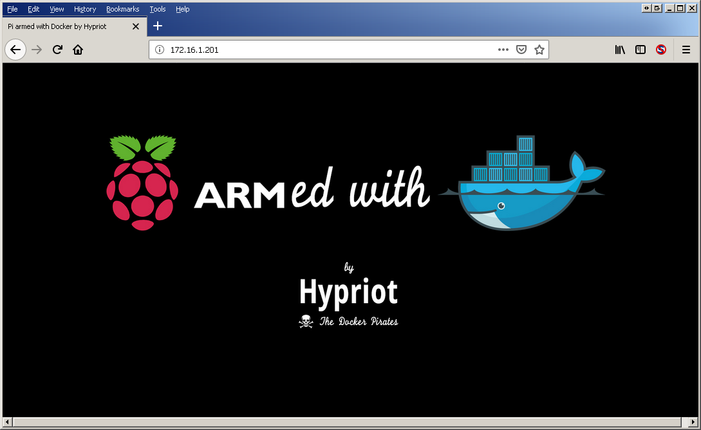

# Kubernetes Raspberry Pi 4 Cluster

This guide covers the construction, installation and use of a Kubernetes Cluster hosted on a set of Raspberry Pi 4 computers.

Under construction ...
<p align="center">
  
</p>
<p align="center">
      
    </p>

## Hardware

A minimum configuration to demonstrate the features of Kubernetes that I used is as follows:

| Item | Use | Example | Quantity |Notes | 
|------|-----|---------|--------|---|
| Controller | Raspberry Pi 4 Model B   | [Amazon Link](https://www.amazon.co.uk/Raspberry-Pi-MODEL-2GB/dp/B07TGBLK33) | 1 |Any RPi with 4 cores and 1GB RAM+ | 
| Workers | Raspberry Pi 4 Model B   | [Amazon Link](https://www.amazon.co.uk/Raspberry-Pi-MODEL-2GB/dp/B07TGBLK33) | 3 |Use a model with 4GB RAM and Quad Core CPU | 
| Power | Anker PowerPort 60 W 6-Port  | [Amazon Link](https://www.amazon.co.uk/Anker-PowerPort-Family-Sized-Technology-Smartphones-Black/dp/B00PK1IIJY)  |  1    |   | 
| USB Cables | Power to Pi's    | [Amazon Link](https://www.amazon.co.uk/gp/product/B00OOOHPN8) |   1 Pack       | Need 4      | 
| USB C Adaptors | Power to Pi's    | [Amazon Link](https://www.amazon.co.uk/Anker-Adapter-female-Converts-Resistor/dp/B078NLG53R) |   1 Packs       | Need 4      | 
| Switch   | Network / 8 ports |  [Amazon Link](https://www.amazon.co.uk/gp/product/B00AWM7PKO) |  1      |  Only 5 ports needed. Note 1 | 
| Ethernet Cables  | Network |  [Amazon Link](https://www.amazon.co.uk/gp/product/B01LF80T4M) | 1 Pack       | Need 4      | 
| USB to 12 Converter  | Switch Power    |    [Amazon Link](https://www.amazon.co.uk/gp/product/B071X6VYXR)    |   1     | Note 2      |
| Frame | Somewhere for your Pi's to live | [Amazon Link](https://www.amazon.co.uk/dp/B07BGYNJVG) | 2 | |
| Storage | O/S Storage | [Amazon Link](https://www.amazon.co.uk/gp/product/B074B573C4) | 4 | Cheap and seem to work ok |

**Note 1** Netgear also produce a 5 port switch that runs from 5V. (8 port needs 12V). I wanted to run a bigger cluster so went for 8 ports.

**Note 2** The 5V to 12V cable is just to make things tidier.  You can use the original 12V PSU for the switch. Be careful to check power requirements if not using the original PSU.

## Configure Raspberry Pi Nodes

Software versions:

* O/S version: `Raspbian Buster Lite / Kernel 4:19`
* Kubernetes version: `v1.15.0`
* Docker version: `18.09.0`

Network:

* Master node: `172.16.1.210 (Host name: kubectl4)`
* Worker node: `172.16.1.211..214 (Host names: worker41..44)`
* Ingress node: `172.16.1.211`
* Gateway: `172.16.1.1`
* DNS: `1.1.1.1, 8.8.8.8`

### Install O/S

* Install Raspbian Buster Lite [Download](https://www.raspberrypi.org/downloads/raspbian/) onto an SD card and boot
* Update networking to set a static IP, Gateway and DNS addresses (IPV4 only for now). 

`sudo nano /etc/dhcpcd.conf`
* Disable the swap file
```
sudo dphys-swapfile swapoff
sudo dphys-swapfile uninstall
sudo systemctl disable dphys-swapfile
```
* Run the config tool (`sudo raspi-config`),  enable `ssh`and set the `hostname`
* Reboot (Must do this now due to host name change)

* Install Docker
```
sudo curl -sL get.docker.com | sed 's/9)/10)/' | sh
sudo usermod -aG docker pi
```

<p align="center">
  
</p>

* Add Kubernetes repository
```
curl -s https://packages.cloud.google.com/apt/doc/apt-key.gpg | sudo apt-key add - 
echo "deb http://apt.kubernetes.io/ kubernetes-xenial main" | sudo tee /etc/apt/sources.list.d/kubernetes.list 
```
**Note** No specific Buster release is available at the time of writing.  However, the Xenial version appears to work without issue.

* Update software
```
sudo apt update -qy
sudo apt upgrade -qy
```
* Edit boot configuration 

`sudo nano  /boot/cmdline.txt` 

...and add the following options 

```ipv6.disable=1 cgroup_enable=cpuset cgroup_enable=memory cgroup_memory=1```
* Reboot

This gives a basic configuration ready to install Kubernetes on

### Install Kubernetes

```sudo apt-get install -qy kubeadm```

This is now a complete base image which can be used for control and worker nodes.  To save time, make an image copy to all of your SD cards.
Don't forget to change IP addresses and host names !

## Install Kubernetes Master Node

Select the machine you are going to use as the master node

* Load images 

```kubeadm config images pull```

* Install
```
sudo kubeadm init
```

* Once complete, note the line starting 

`kubeadm join --token`

You will need this later to join worker nodes to the cluster (Note 1)

* Make the install generally available
```
mkdir -p $HOME/.kube
sudo cp -i /etc/kubernetes/admin.conf $HOME/.kube/config
sudo chown $(id -u):$(id -g) $HOME/.kube/config
```

**Note 1:** You can always regenerate the token at a later date by usuing:
```$xslt
kubeadm token generate
kubeadm token create <token printed from previous command> --print-join-command --ttl=0
```

## Configure Networking

Most guides use [Flannel](https://github.com/coreos/flannel) as the networking layer. However, I found it impossible to get it working so used [Weave](https://github.com/weaveworks/weave) instead.

* Install networking
```
sudo sysctl net.bridge.bridge-nf-call-iptables=1
kubectl apply -f "https://cloud.weave.works/k8s/net?k8s-version=$(kubectl version | base64 | tr -d '\n')"
```

* Show system to confirm install
```
kubectl get pods --all-namespaces
kubectl get nodes
``` 

<p align="center">
  
</p>

## Install Kubernetes Worker Node

To add a worker node to the cluster, execute a `kubeadm join` command using the values generated earlier.

* If the master node was at `172.16.1.210`, the command would be in the form:
```
sudo kubeadm join 172.16.1.210:6443 --token <token here>  --discovery-token-ca-cert-hash sha256:<hash value here>
```
* Add the other worker nodes
* On the master node, execute `kubectl get nodes` to show the complete cluster

The cluster is now complete


# *** Everything Past Here is Untested ***


## Publish a Basic Test Service

As a demonstration, we will now deploy the [Hypriot Busybox](https://hub.docker.com/r/hypriot/rpi-busybox-httpd/) service (A Raspberry Pi compatible Docker Image with a minimal `Busybox httpd` web server )

### Deploy the Service

* Deploy service on 2 containers
```
kubectl run hypriot --image=hypriot/rpi-busybox-httpd --replicas=2 --port=80
kubectl expose deployment hypriot --port 80
kubectl get endpoints hypriot
```
* Verify Deployment on Worker Nodes
```
curl <IP address of an endpoint (Not a worker node IP address)>

<html>
<head><title>Pi armed with Docker by Hypriot</title>
  <body style="width: 100%; background-color: black;">
    <div id="main" style="margin: 100px auto 0 auto; width: 800px;">
      
    </div>
  </body>
</html>
```

### Deploy a Loader Balancer and Ingress Point

Now we have the service running we need to configure a single ingress point with a load balancer.

* Install load balancer
```
kubectl apply -f https://raw.githubusercontent.com/hypriot/rpi-traefik/master/traefik-k8s-example.yaml
kubectl label node <worker node to host load balancer> nginx-controller=traefik
```
* Create an ingress point
```
cat > hypriot-ingress.yaml <<EOF
apiVersion: extensions/v1beta1
kind: Ingress
metadata:
  name: hypriot
spec:
  rules:
  - http:
      paths:
      - path: /
        backend:
          serviceName: hypriot
          servicePort: 80
EOF

kubectl apply -f hypriot-ingress.yaml
```
Verify all nodes are connected and running

<p align="center">
  
</p>

Verify correct operation by pointing a browser at the ingress node:

<p align="center">
  
</p>

**_...and this probably won't work. Recent changes in Kubernetes have introduced Role Based Access Control (RBAC)_**

### How to Bypass RBAC

For running test configurations, using [RBAC](http://docs.heptio.com/content/tutorials/rbac.html) can be painful. A (not recommended for production) way around this is:
```
kubectl create clusterrolebinding varMyClusterRoleBinding --clusterrole=cluster-admin --serviceaccount=kube-system:default
```
A reboot of the cluster will probably be needed after this.

*Note:* From a cold start, the cluster takes approximnately 5 minutes before the ingress responds with the Hypriot web page


